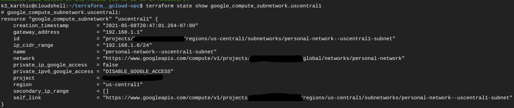

# Terraform — Create a VPC in Google Cloud
Create a VPC in Google Cloud.

The Terraform script below deploys a server under the [Google Cloud Always Free](https://cloud.google.com/free/) tier,
* terraform__gcloud-instance
	* GitHub: [github.com/k3karthic/terraform__gcloud-instance](https://github.com/k3karthic/terraform__gcloud-instance)
	* Codeberg: [codeberg.org/k3karthic/terraform__gcloud-instance](https://codeberg.org/k3karthic/terraform__gcloud-instance)

## Code Mirrors

* GitHub: [github.com/k3karthic/terraform__gcloud-vpc](https://github.com/k3karthic/terraform__gcloud-vpc/)
* Codeberg: [codeberg.org/k3karthic/terraform__gcloud-vpc](https://codeberg.org/k3karthic/terraform__gcloud-vpc)

## Requirements

Enable the Compute Engine API from [https://console.cloud.google.com/apis/api/compute.googleapis.com/overview?pli=1](https://console.cloud.google.com/apis/api/compute.googleapis.com/overview?pli=1).

## Configuration

1. Create a file to store the [Terraform input variables](https://www.terraform.io/docs/language/values/variables.html). Use `google.tfvars.sample` as a reference. Keep `google.tfvars` as the filename or change the name in the following files,
    1. `.gitignore`
    1. `bin/plan.sh`
1. Set the `region` input variable. The following regions are available in the free tier ([cloud.google.com/free/docs/gcp-free-tier/#compute](https://cloud.google.com/free/docs/gcp-free-tier/#compute)),
    1. *Oregon:* us-west1
    2. *Iowa:* us-central1
    3. *South Carolina:* us-east1
4. Keep `us-central1` as the region or change the variable name `uscentral1_cidr` to match the new region. 

## Authentication

[Google provider](https://registry.terraform.io/providers/hashicorp/google/latest/docs) documentation is at [registry.terraform.io/providers/hashicorp/google/latest/docs](https://registry.terraform.io/providers/hashicorp/google/latest/docs).

[Google Cloud Shell](https://cloud.google.com/shell/) can deploy this script without configuration.

## Deployment

**Step 1:** Use the following command to create a [Terraform plan](https://www.terraform.io/docs/cli/run/index.html#planning),
```
$ ./bin/plan.sh
```

To avoid fetching the latest state of resources, use the following command,
```
$ ./bin/plan.sh -refresh=false
```

**Step 2:** Review the plan using the following command,
```
$ ./bin/view.sh
```

**Step 3:** [Apply](https://www.terraform.io/docs/cli/run/index.html#applying) the plan using the following command,
```
$ ./bin/apply.sh
```

**Step 4:** Display the created subnetwork using the following command,
```
$ terraform state show google_compute_subnetwork.uscentral1
```



## Encryption

Encrypt sensitive files (Terraform [input variables](https://www.terraform.io/docs/language/values/variables.html) and [state](https://www.terraform.io/docs/language/state/index.html)) before saving them. `.gitignore` must contain the unencrypted file paths.

Use the following command to decrypt the files after cloning the repository,
```
$ ./bin/decrypt.sh
```

Use the following command after running `bin/apply.sh` to encrypt the updated state files,
```
$ ./bin/encrypt.sh <gpg key id>
```

